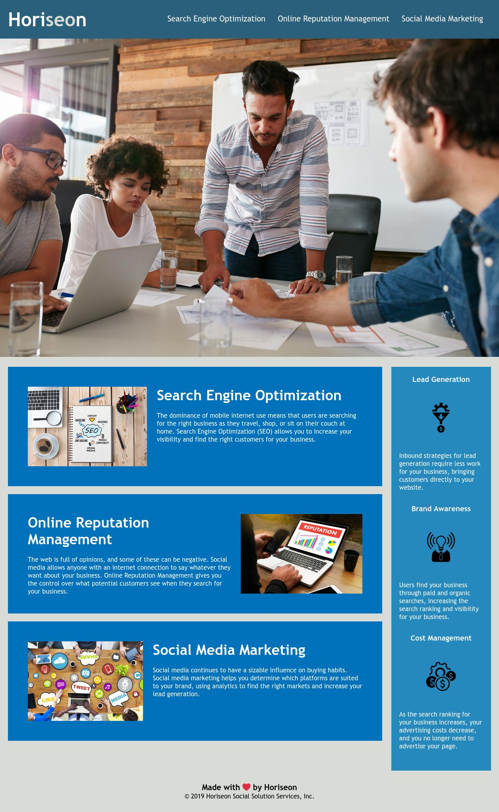

# Horiseon Refactor Challenge

## Project Description
Given a starting base of HTML and CSS - the task here was to logically identify each area of the webpage and assign Semantic HTML in the appropriate places, as well as add image alt attributes - both of which will increase the Search Engine Optimization of the Horiseon website. Further, edits were applied to the CSS to align with the revised Semantic HTML document structure, and redundant styles consolidated where possible.

## Contents
1. [Deployed Page](#deployed-page)
2. [Actions Taken](#actions-taken)
3. [Contributions](#contributions)

## Deployed Page

[Deployed GitHub Page](https://dereksutton.github.io/horiseon-refactor/)

## Actions Taken
* Added a title to the webpage.
* Added comments to index.html and style.css to guide refactoring.
* Defined logical HTML structure and applied semantic HTML elements in place of divs.
* Shifted old CSS code to match with updated semantic HTML document structure.
* Identified and consolidated redundant styles.
* Removed unnecessary class attributes.
* Added alt attributes to images to increase web page accessibility and improve SEO.
* Fixed issue with text overflow behavior when resizing browser.

## Contributions
* This Horiseon web page was created & provided by Georgia Tech Full-Stack Coding Bootcamp.
* The HTML & CSS refactoring completed by [Derek Sutton](https://github.com/dereksutton)
